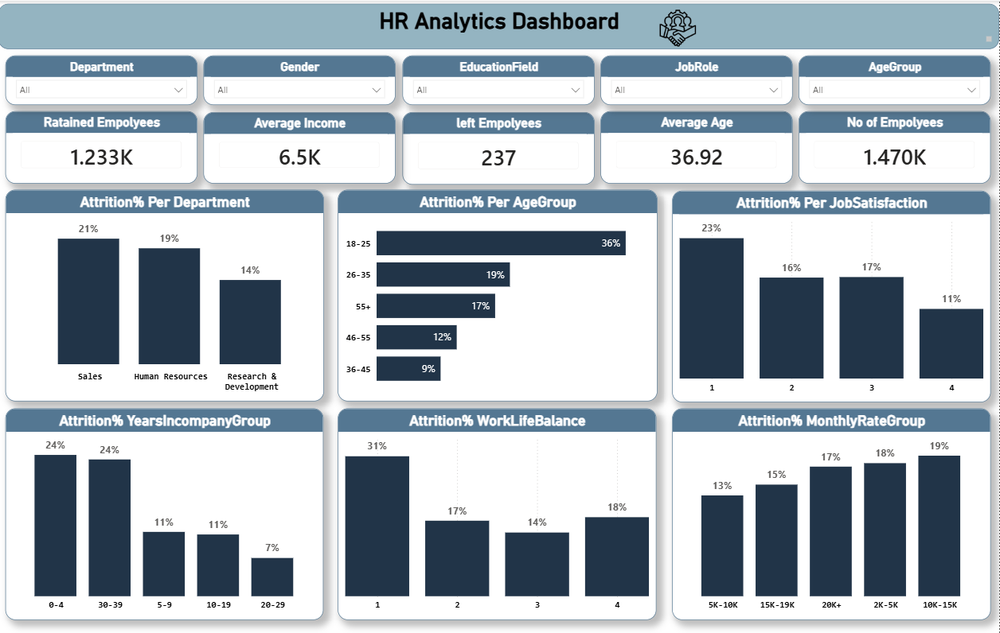

# HR Data Analysis | Employee Attrition

## 📊 Overview
This project analyzes employee attrition data using **Power BI** to uncover key patterns behind why employees leave the company. The interactive dashboard breaks down attrition rates across departments, age groups, job satisfaction levels, tenure, and work-life balance to help HR teams make data-driven retention decisions.

## 🎯 Key Insights
- Total employees analyzed: **1.47K**
- Retained employees: **1.233K** | Left employees: **237**
- Average employee age: **36.92**
- Average monthly income: **6.5K**
- Highest attrition rate is among the **18-25 age group (36%)**
- **Sales department** has the highest attrition rate (21%), followed by HR (19%) and R&D (14%)
- Employees with the **lowest job satisfaction** (level 1) show the highest attrition (23%)
- Employees with **poor work-life balance** (level 1) show the highest attrition (31%)

## 🛠️ Tools Used
- **Power BI** – Dashboard design, DAX measures, data visualization
- **Excel** – Data cleaning and preprocessing

## 📈 Dashboard Features
- Interactive slicers: Department, Gender, Education Field, Job Role, Age Group
- KPI cards for quick overview (retained/left employees, average income, average age)
- Breakdown charts: Attrition % by Department, Age Group, Job Satisfaction, Years in Company, Work-Life Balance, Monthly Rate Group
- Two-page layout: Attrition Analysis & Employees Analysis

## 📷 Preview

## 📁 Repository Contents
- `HR-Attrition-Dashboard.pbix` – Power BI file
- `dashboard-preview.png` – Dashboard screenshot
- `README.md` – Project documentation

## 👤 Author
Abdelrahman Anwar – Data Analyst
[LinkedIn](#) | [Upwork](#)
